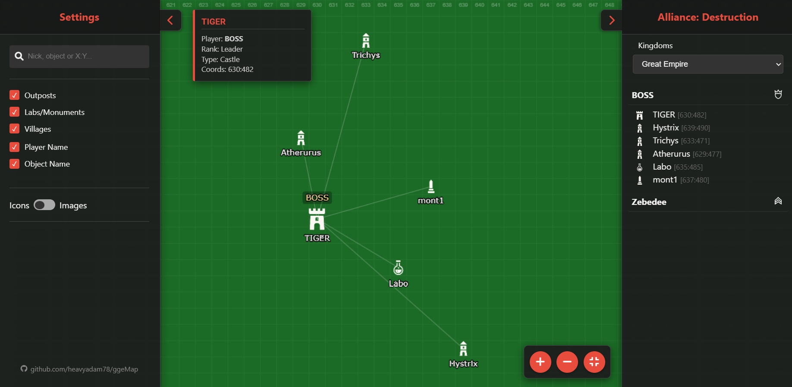

# 🗺️ ggeMap - Interactive Alliance Map

**ggeMap** is a lightweight, fast, and interactive web tool for visualizing player positions on the game world map (GGE). The project uses **HTML5 Canvas** for rendering, ensuring high performance even with a large number of objects.




## ✨ Key Features

*   **4 Kingdoms Support:** Great Empire, Everwinter Glacier, Burning Sands, Fire Peaks.
*   **High Performance:** Smooth zooming and panning thanks to the Canvas API.
*   **Search Engine:** Quickly find players by nickname, object name, or coordinates (X:Y).
*   **Advanced Filtering:** Toggle visibility of outposts, laboratories, resource villages, and monuments.
*   **Player List:** Sidebar with a tree structure of the alliance (Grouped by rank).
*   ~~**Icon/Image Mode:** Switch between simplified icons and building graphics (LOD).~~
*   **Responsive UI:** Collapsible sidebars.
*   **Settings Persistence:** Remembers camera position, filters, and selected kingdom (LocalStorage).

## 🚀 How to Run?

The project is a static site; it requires no server installation or Node.js. You can run it in two ways:

### Option 1: Download ZIP (Easiest)
If you don't use Git, you can simply download the files:
1.  Scroll to the top of this GitHub page.
2.  Click the green **<> Code** button.
3.  Select **Download ZIP**.
4.  Extract the downloaded folder on your computer.
5.  Double-click `index.html` to open the map in your browser.

### Option 2: Git (For advanced users)
1.  Clone the repository:
    ```bash
    git clone https://github.com/heavyadam78/ggeMap.git
    ```
2.  Open `index.html`.

## ⚙️ Data Configuration

All player data is located in `js/data.js`. Data is organized in a "One Player - Many Kingdoms" structure.

### `ALL_PLAYERS` Structure

```javascript
const ALL_PLAYERS = [
    {
        name: "PlayerNick",
        rank: "leader", // Ranks: leader, deputy, warmarshal, general, sargent, member, novice
        kingdoms: {
            // 1. Great Empire (Green)
            "default": {
                castle: { name: "Main Castle", x: 500, y: 500 },
                outposts: [
                    { name: "Post 1", x: 502, y: 502 },
                    { name: "Post 2", x: 505, y: 505 }
                ],
                labs: [],      // Optional
                monuments: []  // Optional
            },
            
            // 2. Everwinter Glacier (Ice)
            "lodzik": {
                castle: { name: "Winter Castle", x: 200, y: 200 },
                villages: [    // Resource Villages
                    { name: "Food Village", x: 205, y: 205 }
                ]
            },
            
            // 3. Burning Sands
            "piasek": {
                 castle: { name: "Sand Castle", x: 100, y: 100 }
            },
            
            // 4. Fire Peaks
            "szczyty": {
                 castle: { name: "Fire Castle", x: 300, y: 300 }
            }
        }
    },
    // ... next player
];
```

### Available Object Types
*   `castle` (Main Castle - required in a given kingdom)
*   `ruin` (Ruins - alternative to castle)
*   `outposts` (Outposts)
*   `villages` (Resource Villages - in elemental kingdoms)
*   `labs` (Laboratories)
*   `monuments` (Monuments)

## 🎨 Customization (`config.js`)

In `js/config.js`, you can customize the map's appearance:
*   Background colors for specific kingdoms (`kingdomBackgrounds`).
*   Line and marker colors.
*   Paths to icons and graphics (`images`).
*   Object sizes on the map.

## 🎮 Controls

*   **LMB + Drag:** Pan the map.
*   **Mouse Wheel:** Zoom In / Zoom Out.
*   **Click (LMB):** Select player/object.
*   **Right Panel:** Player list (click to center map on object).
*   **Left Panel:** Search and visibility filters.

## 🛠️ Technologies

*   HTML5
*   CSS3 (Flexbox, CSS Variables)
*   JavaScript (ES6+)
*   Font Awesome 6 (Icons)

---
*Project created for educational and hobby purposes.*
*This is an unofficial fan tool.*